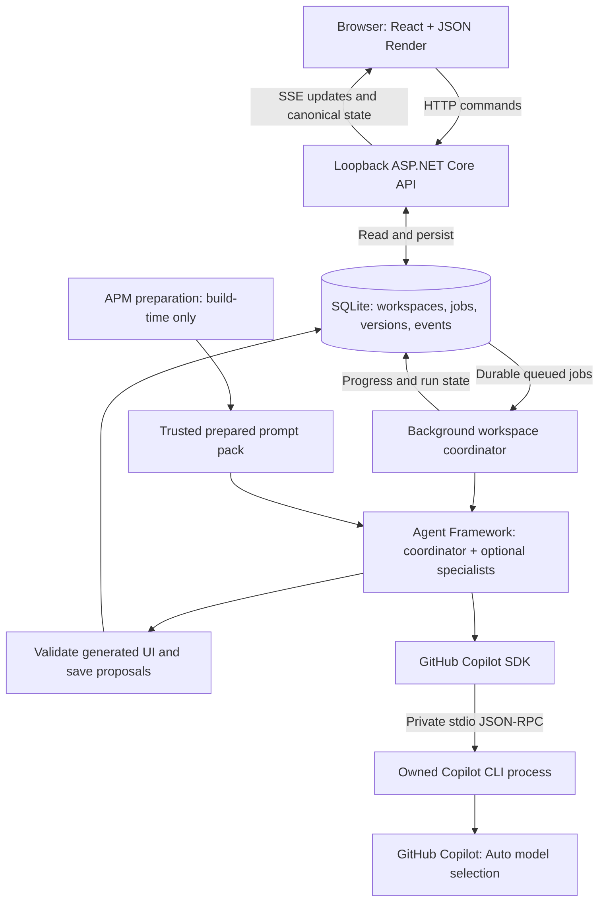

# Workspaces

A local, single-user browser application for **human-led, multi-agent work**.
Describe an outcome, clarify it on a task-specific canvas, inspect declarative
artifacts, and keep steering while agents work in the background. Agent output
is a proposal; approval and direct edits remain yours.

**Generative UI is the main differentiator:** agents choose appropriate visual
controls and artifact layouts from a validated JSON Render catalog, rather
than putting every interaction into a chat transcript or text questionnaire.
The implementation follows the supplied prototype and its linked Relay / One
Copilot Figma screens.

[Setup](#setup-overview) | [Architecture](#architecture-overview) |
[Repository layout](#repository-layout) | [Development](#development-and-verification) |
[Troubleshooting](#troubleshooting)

## Setup overview

These instructions target **Windows and PowerShell 7**. Run commands from the
repository root unless a command explicitly changes directory.

| Prerequisite | Why it is needed |
| --- | --- |
| [.NET 10 SDK](https://dotnet.microsoft.com/download/dotnet/10.0) | Builds and runs the local API, coordinator and agent workflow. `global.json` permits .NET 10 feature-band roll-forward. |
| [Node.js 22.12+](https://nodejs.org/en/download) and npm | Builds the React browser app. Node is not a separate application server in the normal local setup. |
| [PowerShell 7](https://learn.microsoft.com/powershell/scripting/install/installing-powershell-on-windows) | Runs the included startup and agent-pack scripts. |
| A modern browser | Runs the canvas and generated UI. Browser tests use installed Microsoft Edge. |
| [Copilot CLI](https://docs.github.com/en/copilot/how-tos/set-up/install-copilot-cli) and eligible Copilot access | Required for live inference, but not for the explicitly labelled demo provider. |

APM does **not** need to be installed for ordinary startup: the trusted prepared
prompt pack is included in the repository. Install it only when rebuilding that
pack.

### Start the application

Check the local prerequisites, then launch:

```powershell
dotnet --version
node --version
pwsh --version

pwsh -NoProfile -File .\scripts\start.ps1
```

Open **http://127.0.0.1:5080**. The launcher:

1. Installs browser dependencies with `npm ci` when `web\node_modules` is absent.
2. Type-checks and builds the browser into `web\dist`.
3. Restores the server against its NuGet lockfile and builds it, including the
   prepared agent pack.
4. Starts ASP.NET Core on loopback, serving both the API and built browser assets.

Keep that terminal open; **Ctrl+C** stops the app. After a successful build, use
`-SkipBuild` to start without restoring or rebuilding. If browser dependencies
change, run `npm --prefix web ci` before rebuilding.

### Choose live or demo execution

**Live Copilot** always uses **Auto model selection** through the official SDK
and CLI, including resumed sessions. The app does not force a reasoning-effort
setting; Copilot manages the underlying model.

**Try a demo workspace** uses a separate, clearly labelled, deterministic
provider with no model calls. Both modes use the real MAF workflow, durable
queue, declarative renderer, review policy and persistence. Live errors never
silently become demo results.

### Connect Copilot

Check provider readiness without generating a completion:

```powershell
pwsh -NoProfile -File .\scripts\start.ps1 -CheckProvider
```

The app uses an isolated CLI home. If sign-in is needed, run the **exact setup
command shown by the app** in a separate PowerShell window, then recheck. It
does not copy credentials from another home or collect tokens in the browser.
An account must have an available model for Auto; unsupported configurations
fail explicitly. `-CheckProvider` exits with code `0` when ready and `2` when
setup or compatibility needs attention.

If automatic executable discovery does not find your trusted installation,
set its actual absolute path before starting:

```powershell
$env:Workspaces__CopilotExecutable = 'C:\Tools\Copilot\copilot.exe'
```

The recorded tested CLI is **1.0.87-0 preview**; the SDK is pinned to
**1.0.14**. CLI protocol and effective model/tool policy are verified at runtime,
not inferred from the version number. See [provider details](docs/copilot-provider.md).

## The interaction loop

1. Start a task. Its objective, agent sessions, artifacts, feedback and layout
   belong to a dedicated saved workspace.
2. Clarify with the best control for each decision: choice cards, multi-select
   chips, labelled sliders, number/date inputs, or switches. Text is reserved
   for genuinely open information. Defaults, a selection summary and optional
   refinements keep the form focused. Existing forms can be explicitly
   **regenerated** with the visual catalog.
3. The coordinator drafts directly when it can. It recruits only the specialists
   the task needs, rather than creating a fixed producer/reviewer team. An
   independent agent review is optional; your approval is always required.
4. Select an artifact block and choose **Give direction**. Submit several notes
   without waiting for an agent response. Each retains the selected block,
   original revision and quoted context; Activity shows its actual job state.
5. Inspect proposals and any specialist review. **Accept version**, **Reject**, or
   **Edit text** explicitly. Accepted versions and revision history stay
   available; late agent changes cannot overwrite a human edit.
6. Switch tasks or refresh without losing saved work. Pan/zoom/fit the spatial
   canvas, or use **Focus view** for a readable document layout.

Cancel stops the selected run; retry is explicit. After a service restart,
unfinished jobs are marked interrupted instead of being silently replayed.
A never-prompted CLI session can be unresumable after an early failure. Stop
queued/active work, confirm **Start new session** for the affected Copilot agent,
then retry. Workspace data and the previous session reference remain in the
audit trail; no old CLI session is deleted automatically.

## Architecture overview

The browser owns presentation and human interaction. The local service owns
durable work, validation, agent execution and credentials. Copilot CLI is never
exposed directly to the browser.



| Layer | Implementation |
| --- | --- |
| Browser | React 19.3, TypeScript, Vite 8.3; neutral Segoe/system styling and genuine Fluent icons |
| Declarative UI | JSON Render core/react 0.21.0 with a strict host-owned component/schema boundary |
| Local service | ASP.NET Core / .NET 10; loopback-only HTTP, mutation token, same-origin policy, SSE replay |
| Orchestration | Microsoft Agent Framework Workflows 1.22.0, a coordinator plus its bounded task-specific specialist graph |
| Agent provider | GitHub Copilot SDK 1.0.14, managed CLI stdio, restricted per-role sessions, streaming and explicit abort |
| Package lifecycle | Microsoft APM 0.31.0, authored local prompt package, generated lock and hash-checked prepared inputs |
| Persistence | SQLite 10.0.12 provider; transactional workspace documents, feedback queues, revisions and public events |

### How a task moves through the system

The API persists a task and its queued job before acknowledging it. A background
worker claims the job, and the MAF coordinator either asks for missing decisions,
returns a direct artifact, or declares a bounded team of **zero to four**
specialists. Only declared specialists are registered and executed.

The provider creates or resumes isolated role sessions through the Copilot SDK.
Generated JSON is validated against the application catalog before it is saved
or rendered. JSON Render then displays the selected components; host-owned
controls submit answers and feedback. Human approval is an API state transition,
never a model-authored instruction.

Feedback is saved with its artifact, block and original revision, then processed
against the latest working draft. Late results that conflict with human changes
remain reviewable proposals rather than overwriting those changes.

### Persistence, transport and trust

Default data lives in **`.data`**: the workspace database plus isolated provider
state under `.data\copilot\home`. This directory may contain CLI-managed
credentials and private task content. It is ignored by Git; do not serve,
publish or share it. Stop the service before backing up its complete data
directory. Set `Workspaces__DataDirectory` to select another trusted local path.

There is one active writing workflow per workspace and at most two across the
application. Feedback is durably acknowledged before inference. Browser
disconnection does not cancel a run. Events expose safe progress, not hidden
reasoning, raw CLI logs, credentials or SDK RPC.

Live agents are **tool-free drafting/analysis agents** in this MVP. They cannot
execute shell commands, edit local files, fetch arbitrary resources, register
remote agents or approve their own proposals. Capability restrictions are not
an OS sandbox. This is not a multi-user, enterprise-authenticated or
production-deployed service; do not expose its port beyond loopback.

The rendering catalog supports sections, headings, text, lists, tables,
decisions and seven semantic clarification control types. Generated forms are
checked for excessive required questions and open text fields; the model is
instructed to ask only what is needed and to choose visual controls by meaning.
Unknown components, arbitrary actions,
dynamic expressions, executable markup, cycles and oversized trees are rejected.
JSON Render's catalog validator alone is not treated as a trust boundary.

## Repository layout

```text
web\                              React canvas, JSON Render catalog, styles and UI tests
src\Workspace.Server\              ASP.NET Core host, API, validation and SQLite persistence
src\Workspace.Server\Orchestration\ MAF graphs, prompt context and output validation
src\Workspace.Server\Providers\    Copilot SDK adapter and explicit demo provider
agent-pack\source\                 Authored trusted agent instructions and prompts
agent-pack\prepared\               APM-prepared runtime input and integrity receipt
scripts\                          Startup and APM preparation commands
tests\Workspace.Server.Tests\     Backend, orchestration and provider tests
tests\browser\                    Real Edge end-to-end tests
docs\                             Detailed architecture, API and integration notes
.data\                            Generated private runtime state; ignored by Git
```

## Configuration

The service reads the `Workspaces` section of
`src\Workspace.Server\appsettings.json`. Environment variables use ASP.NET Core's
double-underscore notation and override those values.

| Environment variable | Default / purpose |
| --- | --- |
| `Workspaces__DataDirectory` | Repository `.data` directory; use a trusted, writable local directory. |
| `Workspaces__CopilotExecutable` | Automatic discovery; override with a trusted absolute executable path. |
| `Workspaces__Port` | `5080`; valid range `1024-65535`, always bound to loopback. |
| `Workspaces__ProviderTimeoutSeconds` | `180`; whole-operation provider budget, configurable from `10-600`. |
| `Workspaces__DemoDelayMilliseconds` | `500`; demonstration pacing, configurable from `0-5000`. |
| `Workspaces__AgentPackDirectory` | `agent-pack` in the server output directory; override only with a trusted prepared pack. |

For example, to keep data outside the checkout:

```powershell
$env:Workspaces__DataDirectory = Join-Path $env:LOCALAPPDATA 'Workspaces'
pwsh -NoProfile -File .\scripts\start.ps1
```

Model selection is deliberately **Auto**, not a configurable per-task override.
If you change the service port, use the actual listening URL from the service
log; the launcher banner shows the default URL. The Vite proxy must also be
updated to match when using a nondefault backend port.

## Development and verification

After the setup above, stop the normal launcher, then run the API and Vite in
separate PowerShell windows:

```powershell
dotnet run --project .\src\Workspace.Server\Workspace.Server.csproj --launch-profile http
```

```powershell
npm --prefix web run dev
```

Vite uses **127.0.0.1:5174**, proxies the API to 5080, and leaves the reference
prototype's port 5173 untouched. The `http` backend launch profile enables the
specific development origin; the normal start script serves built assets on
one origin. Vite provides frontend hot reload. Restart the API after backend
changes; finish or cancel active agent work before restarting it.

### Automated checks

```powershell
dotnet restore .\Workspaces.slnx --locked-mode
dotnet test .\Workspaces.slnx --no-restore
npm --prefix web test
npm --prefix web run build
```

Real-browser regression tests use a separately pinned Playwright runner and
installed Microsoft Edge. Start the application with a **dedicated test data
directory** first: these tests create demo workspaces and edit their artifacts.
They do not request live completions.

In the application's terminal, select a separate data directory before starting:

```powershell
$env:Workspaces__DataDirectory = Join-Path (Get-Location) '.data\browser-verification'
pwsh -NoProfile -File .\scripts\start.ps1
```

Then run the browser tests in another terminal:

```powershell
Push-Location .\tests\browser
npm ci --ignore-scripts --no-audit --no-fund
npm test
Pop-Location
```

Normal .NET tests skip the real-provider probes. The opt-in two-completion
cold-resume test consumes Copilot usage and must be requested explicitly:

```powershell
$env:WORKSPACES_COPILOT_LIVE_SMOKE = '1'
dotnet test .\tests\Workspace.Server.Tests\Workspace.Server.Tests.csproj `
  --filter FullyQualifiedName~CopilotLiveTests
Remove-Item Env:\WORKSPACES_COPILOT_LIVE_SMOKE
```

### Updating agent prompts

The prepared APM pack is included, so normal startup does not install packs or
run APM. To change trusted prompts, follow [agent-pack preparation](docs/agent-pack.md)
and commit source, generated lock and prepared output together. Baseline APM
auditing passed; unavailable remote organization-policy lookup is explicitly
documented, not claimed as verified.

The configured npm mirror lacked JSON Render 0.21.0. `web\vendor` preserves the
exact published files, SHA-256 verification metadata and licenses in locked
local archives. No older or substitute renderer is used; see
[frontend provenance](web/README.md).

## Troubleshooting

| Symptom | Next step |
| --- | --- |
| `pwsh`, `dotnet` or `npm` is not found | Install the prerequisites and open a fresh terminal. Use the .NET SDK, not only the runtime. |
| Port 5080 or the workspace data lock is already in use | Stop the existing Workspaces instance with Ctrl+C, or choose a separate port and data directory. Do not stop unrelated processes or delete an active database. |
| Live provider is not ready | Run `-CheckProvider`, follow the isolated-home sign-in command if supplied, then recheck. A normal CLI login in a different home may not apply. |
| `agent_pack_unavailable` or `agent_pack_invalid` | Rebuild so prepared files are copied into the server output. If prompt sources changed, re-prepare the pack using its documented workflow; do not edit the receipt manually. |
| An older workspace still has text-only questions | Refresh the browser, then select **Regenerate questions**. Saved forms are not automatically rewritten or rerun during an upgrade. |
| Work is marked interrupted after restart | Review the saved state and explicitly retry. A never-prompted, unavailable Copilot session may require **Start new session** first. |

## Design and compatibility record

[Architecture and compatibility](docs/architecture.md) records the research
date, official sources, versions, maturity, alternative stacks, Figma findings,
browser/server responsibilities and unverified limitations.
[API and UI contract](docs/api-contract.md) documents wire shapes, concurrency,
recovery and validation boundaries.

Native mobile, multi-user collaboration, arbitrary executable code, unknown
remote agents, marketplace/billing, distributed execution, live M365 connectors
and production deployment are outside this delivery.
